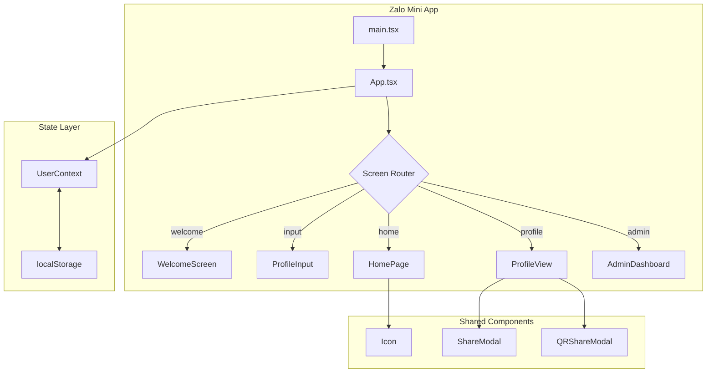

# ThợTốt - Zalo Mini App Documentation

## 📋 Mục Lục

1. [Tổng Quan](#tổng-quan)
2. [Kiến Trúc Hệ Thống](#kiến-trúc-hệ-thống)
3. [Cấu Trúc Thư Mục](#cấu-trúc-thư-mục)
4. [Components](#components)
5. [Pages](#pages)
6. [State Management](#state-management)
7. [Types & Interfaces](#types--interfaces)
8. [Hướng Dẫn Phát Triển](#hướng-dẫn-phát-triển)
9. [Deployment](#deployment)
10. [Roadmap & Cải Tiến](#roadmap--cải-tiến)

---

## Tổng Quan

**ThợTốt** là Zalo Mini App giúp thợ thủ công (điện, nước, điều hòa, xây dựng...) tạo hồ sơ chuyên nghiệp và chia sẻ với khách hàng qua mã QR.

### Tech Stack

| Layer | Technology |
|-------|-----------|
| Framework | Zalo Mini App (ZMP SDK) |
| Frontend | React 18 + TypeScript |
| Build Tool | Vite 5.x |
| Styling | TailwindCSS 3.4 |
| Icons | Custom SVG Icon Component |
| Backend | Firebase (Auth, Firestore, Storage) |
| State | React Context + localStorage |

### Tính Năng Chính

- ✅ Tạo hồ sơ thợ với thông tin cá nhân, kỹ năng
- ✅ Upload ảnh dự án (trước/sau)
- ✅ Bảng giá dịch vụ
- ✅ Đánh giá từ khách hàng
- ✅ Chia sẻ hồ sơ qua QR Code
- ✅ Admin Dashboard để xác minh thợ

---

## Kiến Trúc Hệ Thống



### Screen Flow

```
Welcome → ProfileInput → HomePage ↔ ProfileView
              ↑                        ↓
              └──────── Edit ──────────┘
```

---

## Cấu Trúc Thư Mục

```
Tool_cv/
├── src/
│   ├── app.tsx              # Main app component, screen router
│   ├── main.tsx             # Entry point
│   ├── components/          # Reusable UI components
│   │   ├── Icon.tsx         # SVG Icon component (50+ icons)
│   │   ├── Avatar.tsx       # User avatar display
│   │   ├── ShareModal.tsx   # Share options modal
│   │   ├── QRShareModal.tsx # QR code share modal
│   │   ├── ShareButton.tsx  # Share button component
│   │   ├── SkillBadge.tsx   # Skill tag badge
│   │   ├── StatCard.tsx     # Statistics card
│   │   ├── Watermark.tsx    # Watermark overlay
│   │   └── PortfolioUploader.tsx # Image uploader
│   ├── pages/               # Screen components
│   │   ├── WelcomeScreen.tsx    # Landing/onboarding
│   │   ├── ProfileInput.tsx     # Profile creation form (4 steps)
│   │   ├── HomePage.tsx         # User dashboard
│   │   ├── ProfileView.tsx      # Public profile view
│   │   ├── AdminDashboard.tsx   # Admin verification panel
│   │   ├── ProfileCard.tsx      # Profile card component
│   │   └── ProfileForm.tsx      # Alternative form component
│   ├── context/
│   │   └── UserContext.tsx  # User state management
│   ├── services/
│   │   └── firebase.ts      # Firebase configuration
│   ├── types/
│   │   └── index.ts         # TypeScript interfaces
│   └── css/
│       └── app.css          # Global styles
├── app-config.json          # ZMP app configuration
├── package.json             # Dependencies
├── tailwind.config.js       # Tailwind configuration
├── vite.config.ts           # Vite build configuration
└── .env                     # Environment variables
```

---

## Components

### Icon Component

Custom SVG icon component thay thế Google Material Symbols để đảm bảo icons hiển thị trên Zalo Mini App (CDN bị block).

```tsx
import { Icon } from '../components/Icon';

// Usage
<Icon name="construction" size={24} color="#195de6" />
<Icon name="star" size={16} />
```

**Danh sách icons có sẵn**: `home`, `person`, `call`, `location_on`, `star`, `edit`, `share`, `check`, `close`, `add`, `remove`, `search`, `settings`, `verified`, `construction`, `handyman`, `electric_bolt`, `plumbing`, `ac_unit`, và 30+ icons khác.

### ShareModal & QRShareModal

Modal chia sẻ hồ sơ với các options:
- Gửi qua Zalo
- Sao chép link
- Tải QR Code
- In danh thiếp

---

## Pages

### 1. WelcomeScreen
- Màn hình landing với giới thiệu app
- Button "Bắt đầu" để tạo hồ sơ
- Easter egg: Tap logo 5 lần → Admin Dashboard

### 2. ProfileInput (4 bước)
| Step | Nội dung |
|------|----------|
| 1 | Thông tin cơ bản (tên, SĐT, kinh nghiệm) |
| 2 | Chuyên môn & Bảng giá dịch vụ |
| 3 | Upload ảnh dự án (tối đa 6 ảnh) |
| 4 | Đánh giá từ khách hàng |

### 3. HomePage
Dashboard cá nhân với:
- Thống kê (đánh giá, dự án, năm KN)
- Quick actions (chia sẻ QR, xem hồ sơ, chỉnh sửa)
- Preview hồ sơ

### 4. ProfileView
Trang hồ sơ công khai:
- Header với avatar, tên, verified badge
- Stats row (đánh giá, năm KN, dự án)
- Chứng chỉ & Bằng cấp
- Kỹ năng chính
- Dự án thực tế (gallery)
- Đánh giá gần đây (carousel)
- Bottom action bar (Lưu danh thiếp, Liên hệ)

### 5. AdminDashboard
Panel quản trị để:
- Xem danh sách thợ đăng ký
- Xác minh/từ chối hồ sơ
- Xem chi tiết thông tin

---

## State Management

### UserContext

```tsx
interface UserContextType {
    user: UserProfile | null;
    setUser: (user: UserProfile | null) => void;
    isLoading: boolean;
    isLoggedIn: boolean;
}
```

**Persistence**: Dữ liệu được lưu vào `localStorage` với key `userProfile`.

### Screen Routing

App sử dụng simple state-based routing trong `app.tsx`:

```tsx
type AppScreen = 'welcome' | 'input' | 'home' | 'profile' | 'admin';
const [currentScreen, setCurrentScreen] = useState<AppScreen | null>(null);
```

---

## Types & Interfaces

### UserProfile

```typescript
interface UserProfile {
    uid: string;
    zaloId?: string;
    phoneNumber?: string;
    displayName: string;
    avatarUrl?: string;
    jobTitle: string;
    skills: string[];
    location: { city: string; district: string };
    experienceYears: number;
    bio: string;
    isVerified: boolean;
    servicePrices?: ServicePrice[];
    customerReviews?: CustomerReview[];
    createdAt?: Date;
    updatedAt?: Date;
}
```

### ServicePrice

```typescript
interface ServicePrice {
    service: string;
    minPrice: number;
    maxPrice: number;
}
```

### CustomerReview

```typescript
interface CustomerReview {
    id: string;
    customerName: string;
    customerPhone: string;
    customerAddress: string;
    rating: number;  // 1-5
    comment: string;
    createdAt?: Date;
}
```

---

## Hướng Dẫn Phát Triển

### Prerequisites

- Node.js 18+
- Zalo Mini App Developer Account
- Firebase Project (optional, for production)

### Setup

```bash
# 1. Install dependencies
npm install

# 2. Copy environment file
cp .env.example .env

# 3. Start development server
npm start

# 4. Deploy to Zalo
zmp login
zmp deploy
```

### Build Commands

| Command | Description |
|---------|-------------|
| `npm start` | Start dev server |
| `npm run build` | Build for production |
| `npm run deploy` | Deploy to Zalo |

---

## Deployment

### Deploy to Zalo Mini App

```bash
# Login (first time)
zmp login

# Deploy
zmp deploy
```

### Environment Variables

```env
VITE_FIREBASE_API_KEY=your_api_key
VITE_FIREBASE_AUTH_DOMAIN=your_auth_domain
VITE_FIREBASE_PROJECT_ID=your_project_id
VITE_FIREBASE_STORAGE_BUCKET=your_bucket
VITE_FIREBASE_MESSAGING_SENDER_ID=your_sender_id
VITE_FIREBASE_APP_ID=your_app_id
```

---

## Roadmap & Cải Tiến

### Đã Hoàn Thành ✅

- [x] UI/UX hoàn chỉnh với TailwindCSS
- [x] SVG Icons component (portable)
- [x] Profile creation flow (4 steps)
- [x] QR Code sharing
- [x] Customer reviews
- [x] Service pricing
- [x] Admin dashboard

### Đang Cần Cải Tiến 🔧

1. **Firebase Integration**: Hiện đang dùng localStorage, cần migrate sang Firestore
2. **Zalo Login**: Tích hợp Zalo Auth API để lấy Zalo ID tự động
3. **Image Upload**: Sử dụng Firebase Storage thay vì base64
4. **Push Notifications**: Thông báo khi có khách hàng liên hệ
5. **Analytics**: Theo dõi lượt xem hồ sơ

### Kiến Trúc Đề Xuất (Production)

```
┌─────────────────────────────────────────────┐
│              Zalo Mini App                  │
├─────────────────────────────────────────────┤
│                                             │
│  ┌─────────┐  ┌─────────┐  ┌─────────────┐ │
│  │ Zalo    │  │ Firebase│  │ Cloud       │ │
│  │ Auth    │──│ Auth    │──│ Functions   │ │
│  └─────────┘  └─────────┘  └─────────────┘ │
│                    │                        │
│              ┌─────┴─────┐                  │
│              │ Firestore │                  │
│              │  Database │                  │
│              └───────────┘                  │
│                                             │
└─────────────────────────────────────────────┘
```

---

## License

Private - Doitay.vn © 2024
