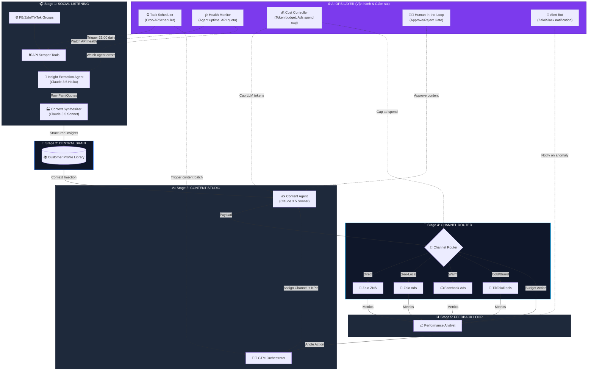
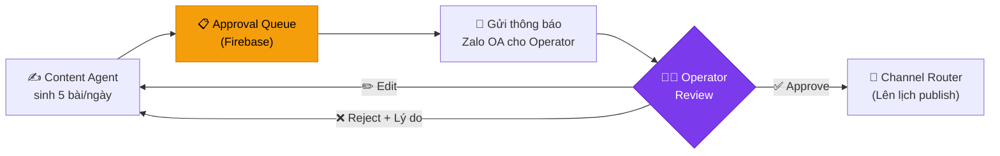

# 🤖 MASTER AI ARCHITECTURE: Hệ thống GTM Tự Động Thu Hút Thợ
> **Tên dự án:** Thợ Tốt Doitay — Zalo Mini App Worker Acquisition Engine.
> **Mục tiêu cốt lõi:** Một cỗ máy AI tự động chạy 24/7 từ bước "Nghe lén mạng xã hội tìm hiểu nỗi đau" cho đến "Sản xuất nội dung Ads" và "Phân bổ ngân sách Media" nhằm thuyết phục anh em thợ tạo Profile năng lực trên Zalo Mini App.

---

## 1. Kiến trúc Tổng thể (End-to-End Pipeline + AI Ops Layer)

Hệ thống gồm **5 Stage chức năng** (luồng chạy dọc) và **1 AI Ops Layer** (luồng chạy ngang, bao bọc toàn bộ pipeline, giám sát và vận hành).

---

## 2. Chi tiết 5 Stages chức năng

### 🎧 Stage 1: Social Listening (Máy Quét Nỗi Đau)
> **Mục đích:** Thu thập "lời ăn tiếng nói" thực tại của thợ ngay ngày hôm nay.
- **Tools:** API Scraper cào Top 30 posts hằng ngày từ các group "Hội Thợ Điện Nước", "Thợ Cấp Thoát Nước", "Hội điện lạnh".
- **Insight Extraction Agent (Haiku):** Nhặt ra những câu than vãn gắt gao nhất.
- **Context Synthesizer (Sonnet):** Gộp các câu than vãn này thành **Vấn đề cốt lõi** và phân loại theo hệ thống.

### 🧠 Stage 2: Central Brain (Thư viện Database)
> **Mục đích:** Kho chất xám cho toàn bộ chiến dịch.
- **Bảng Pain Points:** VD: `P001` = Bị so sánh giá với thợ cỏ; `P004` = Ế cục bộ do mưa bão.
- **Bảng Vocabulary:** Từ lóng bắt buộc AI phải dùng ("Bơm gas đểu", "Thợ đụng").
- **Bảng Validated Angles:** Các góc đánh đã được chứng minh bằng data chạy Ads thực tế.

### ✍️ Stage 3: Content Studio 
> **Mục đích:** Biến Nỗi Đau thành Mồi Câu (Ads/Post).
- **GTM Orchestrator:** Đọc Library → Chọn Pain Point đang nóng nhất hôm nay → Giao việc cho Content Agent.
- **Content Agent (Sonnet):** Nhận Data từ Thư Viện → Sinh nội dung theo 3 Angle (Cái Uy / Sĩ Diện / Cơ Hội).

### 🚀 Stage 4: Channel Router (Định Tuyến Media)
> **Mục đích:** Đưa đúng Content, tới đúng Người, vào đúng Giờ Vàng.
- **11:30 - 13:00 (Trưa):** Video Drama → `TikTok/FB Reels` (Cold Audience).
- **20:00 - 22:30 (Tối):** Ảnh CV đẹp → `Facebook Ads` (Warm Audience).
- **06:00 (Sáng):** Banner Zalo Geo-target 3km → `Zalo Ads` (Local).
- **24/7 (Retarget):** Tin nhắn cá nhân → `Zalo ZNS` (Thợ bỏ dở form).

### 📊 Stage 5: Feedback Loop (Auto-Optimization)
> **Mục đích:** Tối ưu chuyển đổi liên tục, không chờ báo cáo cuối tháng.
- Performance Analyst đọc FireBase Analytics + Meta/Zalo Ads Manager.
- Tự động tái phân bổ ngân sách và điều chỉnh Hook/Angle.

---

## 3. ⚙️ AI OPS LAYER: Luồng Vận Hành AI (Chi tiết)

Đây mới là tầng khiến hệ thống AI hoạt động **đáng tin cậy trong thực tế** chứ không phải chỉ là bản vẽ trên giấy. AI Ops Layer bao gồm 5 thành phần, mỗi thành phần giám sát một khía cạnh của pipeline:

### 3.1 ⏰ Task Scheduler (Bộ lập lịch tự động)
> Tất cả Agents không chạy lung tung — chúng được trigger đúng giờ, đúng thứ tự.

**Lịch vận hành hàng ngày (Daily Ops Cadence):**

| Giờ | Agent được kích hoạt | Hành động | Trigger |
|---|---|---|---|
| **21:00** | 🕷️ Scraper Tools | Cào 30 bài viết Top Engagement từ các Group FB/Zalo | Cron job |
| **21:30** | 🧠 Insight Extraction | Đọc raw text, nhặt pain points mới | Pipeline (chờ Scraper xong) |
| **22:00** | 🏭 Context Synthesizer | Phân loại insight → Cập nhật Library | Pipeline (chờ Extraction xong) |
| **06:00** | 👨‍💼 GTM Orchestrator | Đọc Library, chọn Pain Point nóng nhất → Giao brief cho Content Agent | Cron job |
| **06:30** | ✍️ Content Agent | Sinh nội dung theo brief → Đẩy vào hàng đợi duyệt (Approval Queue) | Pipeline |
| **07:00** | 🧑‍💼 Human Gate | Operator nhận thông báo Zalo OA: *"Có 3 bài mới cần duyệt"*. Bấm Approve/Reject. | Notification |
| **07:30** | 🔀 Channel Router | Nhận bài đã duyệt → Lên lịch phân phối theo khung giờ vàng | Pipeline |
| **11:30** | 📡 Distribution (Batch 1) | Đẩy Video TikTok/Reels (Cold Audience) | Scheduled |
| **18:00** | 📈 Performance Analyst | Kéo data trưa về → Đánh giá hiệu suất batch sáng/trưa | Cron job |
| **20:00** | 📡 Distribution (Batch 2) | Đẩy Facebook Ads Image/Carousel (Warm Audience) | Scheduled |
| **23:00** | 📈 Performance Analyst | Tổng kết ngày → Gửi Daily Report cho Operator qua Zalo | Cron job |

```mermaid
gantt
    title Lịch Vận Hành AI Hàng Ngày (Daily Ops Timeline)
    dateFormat HH:mm
    axisFormat %H:%M

    section Listening
    Scraper cào dữ liệu         :active, s1, 21:00, 30min
    Extraction Agent             :s2, after s1, 30min
    Synthesizer cập nhật Library :s3, after s2, 30min

    section Content
    Orchestrator chọn Pain Point :c1, 06:00, 30min
    Content Agent sinh nội dung  :c2, after c1, 30min
    Human Approve/Reject         :crit, c3, after c2, 30min

    section Distribution
    Batch 1 - TikTok/Reels       :d1, 11:30, 30min
    Batch 2 - FB Ads             :d2, 20:00, 30min
    Retarget ZNS                 :d3, 07:30, 930min

    section Analytics
    Mid-day check                :a1, 18:00, 30min
    Daily report                 :a2, 23:00, 30min
```

### 3.2 🩺 Health Monitor (Giám sát hệ thống)
> Theo dõi mọi Agent và API đang sống hay chết. Xử lý lỗi tự động.

| Đối tượng giám sát | Metric | Ngưỡng cảnh báo | Hành động tự động |
|---|---|---|---|
| **Scraper Tools** | Số bài cào được / ngày | < 10 bài | Retry 3 lần → Chuyển sang cào group dự phòng → Báo Operator |
| **Insight Extraction Agent** | Tỷ lệ JSON parse lỗi | > 20% | Ghi log lỗi → Giảm batch size → Báo Operator |
| **Content Agent** | Thời gian sinh nội dung | > 60 giây / bài | Kiểm tra token limit → Đổi sang model nhẹ hơn (Haiku fallback) |
| **Channel Router APIs** | HTTP Status Code | 4xx/5xx liên tiếp 3 lần | Tạm dừng kênh lỗi → Chuyển budget sang kênh khác → Báo Operator |
| **Zalo ZNS API** | Quota còn lại | < 100 tin | Tạm dừng ZNS drip → Báo Operator nạp thêm quota |

### 3.3 💰 Cost Controller (Kiểm soát chi phí)
> AI tiêu tiền rất nhanh nếu không có "cái thắng". Cost Controller đặt giới hạn cứng cho 2 loại chi phí:

**Chi phí LLM (Token Budget):**

| Agent | Model | Giá (ước tính) | Budget ngày | Tương đương |
|---|---|---|---|---|
| Insight Extraction | Haiku | ~$0.25/1M input tokens | $2/ngày | ~8M tokens (đủ xử lý 500 bài viết) |
| Context Synthesizer | Sonnet | ~$3/1M input tokens | $3/ngày | ~1M tokens |
| Content Agent | Sonnet | ~$3/1M input tokens | $5/ngày | ~10 bài ads hoàn chỉnh |
| Performance Analyst | Sonnet | ~$3/1M input tokens | $2/ngày | ~2 báo cáo phân tích |
| **Tổng LLM/ngày** | | | **~$12/ngày (~300K VNĐ)** | |

**Chi phí Ads (Media Budget):**

| Kênh | Budget ngày (đề xuất MVP) | Mục tiêu đầu ra |
|---|---|---|
| TikTok Ads + FB Reels | 200K VNĐ | ~25K impressions, ~500 clicks |
| Facebook Ads | 150K VNĐ | ~300 clicks to Mini App |
| Zalo Ads | 100K VNĐ | ~200 clicks (Geo-targeted) |
| Zalo ZNS | 50K VNĐ | ~150 tin nhắn retarget |
| **Tổng Ads/ngày** | **500K VNĐ** | |

> **Tổng chi phí vận hành/ngày: ~800K VNĐ** (~$32). Tương đương 1 nhân viên marketing Part-time, nhưng chạy 24/7 không nghỉ.

**Cơ chế chặn (Hard Cap):** Nếu tổng chi phí LLM hoặc Ads vượt 120% budget ngày → Tự động dừng toàn bộ pipeline → Gửi Alert.

### 3.4 🧑‍💼 Human-in-the-Loop (Cổng Duyệt của Operator)
> AI không được "tự ý" publish bất kỳ nội dung nào ra ngoài mà chưa qua Operator duyệt.

**Luồng duyệt Content:**

**Các cấp độ duyệt (Escalation Levels):**

| Loại nội dung | Mức độ rủi ro | Ai duyệt? | Auto-approve? |
|---|---|---|---|
| ZNS nhắc bảo trì định kỳ | Thấp (Template cố định) | Không cần | ✅ Có (template đã duyệt 1 lần) |
| Bài đăng FB Seeding | Trung bình | Operator xem nhanh | ❌ Không |
| Facebook/TikTok Ads (có budget) | Cao (tiêu tiền) | Operator duyệt kỹ | ❌ Không |
| Phân bổ lại ngân sách Ads | Cao | Operator confirm | ❌ Không |

> Theo thời gian, khi Operator tin tưởng chất lượng AI, có thể nâng cấp một số loại nội dung lên **Auto-approve** để giảm tải.

### 3.5 🚨 Alert Bot (Hệ thống cảnh báo)
> Gửi tin nhắn Zalo OA trực tiếp cho Operator khi có sự kiện bất thường.

| Loại Alert | Trigger | Nội dung tin nhắn mẫu |
|---|---|---|
| 🔴 **Critical** | Agent crash, API key hết hạn | *"🚨 KHẨN: Content Agent lỗi 3 lần liên tiếp. Pipeline tạm dừng. Kiểm tra ngay."* |
| 🟡 **Warning** | CTR giảm > 30% so với hôm qua | *"⚠️ CTR Facebook Ads giảm mạnh (3.2% → 2.1%). Analyst Agent đề xuất đổi sang Angle 2."* |
| 🟢 **Info** | Daily report, content chờ duyệt | *"📊 Báo cáo ngày 05/03: 12 Thợ mới tạo CV. Chi phí: 780K. CPA: 65K/thợ."* |
| 🔵 **Opportunity** | Pain point mới nổi bất thường | *"💡 Phát hiện: Keyword 'thợ đóng trần thạch cao' tăng 300% trên Groups ngày hôm nay."* |

---

## 4. Tổng kết: Bảng Danh mục Agent & Tool Toàn hệ thống

| # | Agent | Model | Tools sử dụng | Stage | Ai quản lý (Ops) |
|---|---|---|---|---|---|
| 1 | 🕷️ Data Scraper | N/A (Script) | `fb_graph_scraper`, `zalo_group_listener`, `tiktok_comment_scraper` | Stage 1 | Scheduler + Health Monitor |
| 2 | 🧠 Insight Extraction | Haiku | `llm_json_extractor` | Stage 1 | Cost Controller |
| 3 | 🏭 Context Synthesizer | Sonnet | `firestore_writer`, `dedup_engine` | Stage 1→2 | Cost Controller |
| 4 | 👨‍💼 GTM Orchestrator | Sonnet | `library_query`, `calendar_scheduler` | Stage 3 | Scheduler |
| 5 | ✍️ Content Agent | Sonnet | `llm_copywriter`, `image_prompt_gen`, `video_script_writer` | Stage 3 | Cost Controller + Human Gate |
| 6 | 🔀 Channel Router | N/A (Logic) | `zalo_oa_api`, `zalo_zns_api`, `fb_graph_api`, `tiktok_api` | Stage 4 | Scheduler + Cost Controller |
| 7 | 📈 Performance Analyst | Sonnet | `firebase_analytics`, `meta_ads_api`, `zalo_ads_api` | Stage 5 | Scheduler + Alert Bot |

---

## 5. Lợi thế Cạnh tranh của Kiến trúc này

| Khía cạnh | Cách làm truyền thống | Cách làm AI-First (Kiến trúc này) |
|---|---|---|
| **Nghiên cứu thị trường** | Thuê agency khảo sát 2 tuần | Scraper + Extraction Agent cào insight mỗi đêm |
| **Sáng tạo nội dung** | 1 Content Writer viết 3 bài/ngày | Content Agent sinh 10 bài/ngày, Operator chỉ duyệt |
| **Chạy Ads** | Media Buyer thủ công bật/tắt chiến dịch | Channel Router tự phân phối theo giờ vàng |
| **Tối ưu hiệu suất** | Xem báo cáo cuối tuần | Analyst Agent check 2 lần/ngày, tự đề xuất action |
| **Chi phí nhân sự** | ~15-20 triệu/tháng (1 Marketer) | ~800K/ngày x 30 = 24 triệu/tháng nhưng chạy 24/7 |
| **Khả năng Scale** | Thuê thêm người | Tăng budget LLM + Ads, không cần tuyển |
