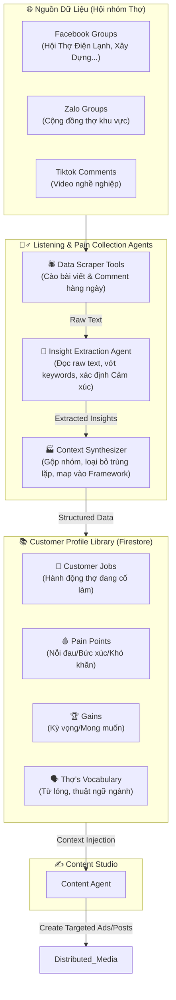

# 🕵️‍♂️ Social Listening & Pain Collection Agent
> **Mục tiêu:** Xây dựng một "Cỗ máy nghe lén" (Listening Engine) tự động cào dữ liệu từ các hội nhóm Thợ trên Facebook/Zalo. Từ đó, trích xuất và phân loại thành một **"Thư viện Nỗi đau" (Pain Point & Job-to-be-done Library)** — biến nó thành nguồn nguyên liệu thô (Input Feeds) chất lượng cao nhất cho Content Creation Agent.

Đây là bước đi cực kỳ xuất sắc, bởi vì Content AI chỉ viết hay khi nó có một bộ Database Insight "thực chiến" và liên tục được cập nhật.

---

## 1. Kiến trúc Tổng thể (The Listening Engine Flow)

Hệ thống bổ sung thêm một luồng **Data Ingestion & Synthesis** diễn ra NGAY TRƯỚC khi Agent Content bắt đầu viết bài. Luồng này chạy ngầm 24/7.



---

## 2. Chi tiết các Agents trong "Listening Engine"

### 🧠 Agent 1: Insight Extraction Agent (Người Đãi Cát Tìm Vàng)
| Thuộc tính | Giá trị / Cấu hình |
|---|---|
| **Vai trò** | Đọc hàng ngàn bình luận, bài đăng rác (raw text) để lọc ra những câu nói mang tính phàn nàn, bức xúc hoặc khoe khoang của thợ. |
| **Model** | `Claude 3.5 Haiku` (Chạy rẻ và cực nhanh cho tác vụ xử lý hàng nghìn text ngắn). |
| **Input** | Dữ liệu thô từ `fb_group_scraper` (Post content, Comments, Timestamp). |
| **Output** | JSON object chứa: `raw_quote`, `intent` (phàn nàn / khoe / hỏi đáp), `sentiment`, và `job_category`. |

**System Prompt (Extraction Agent):**
```text
Bạn là một nhà nghiên cứu nhân chủng học chuyên nghiên cứu hành vi của "Thợ" (người lao động tay chân, sửa chữa, xây dựng) tại Việt Nam.
Dữ liệu đầu vào: Danh sách bài đăng và bình luận từ Facebook Group của thợ.
Nhiệm vụ: Lọc ra TẤT CẢ những câu nói thể hiện:
1. Bị khách hàng ép giá, khinh thường, hoặc quỵt tiền.
2. Than vãn ế ẩm, thiếu việc.
3. Chửi bới các thợ khác phá giá, làm ẩu.
4. Tự hào về tay nghề nhưng không biết cách quảng cáo.
Trả về định dạng JSON nghiêm ngặt.
```

### 🏭 Agent 2: Context Synthesizer (Người Xếp Kho Insight)
| Thuộc tính | Giá trị / Cấu hình |
|---|---|
| **Vai trò** | Nhận các JSON từ Agent 1, gom nhóm các ý giống nhau, phân loại vào ma trận **Value Proposition Canvas (VPC)**. |
| **Model** | `Claude 3.5 Sonnet` (Cần tư duy tổng hợp logic cao hơn). |
| **Output** | Cập nhật trực tiếp vào cơ sở dữ liệu `Customer Profile Library`. |

---

## 3. Cấu trúc của "Customer Profile Library" (Database Schema)

Thư viện này sẽ là "não bộ" của toàn bộ chiến dịch GTM. Dưới đây là cách dữ liệu được lưu trữ để Content Agent dễ dàng query.

### Bảng 1: Pain Points (Nỗi đau)
*Những gì làm thợ mất ngủ đêm nay?*

| Pain ID | Profession | Severity (1-10) | Description | Raw Quotes (Câu nói thực tế) |
|---|---|---|---|---|
| P001 | Điện lạnh | 9 | Khách so sánh giá với thợ "cỏ" | *"Sáng ra báo giá 250k, khách kêu thằng kia lấy 150k. Tức đéo chịu được."* |
| P002 | Xây dựng | 8 | Khách kì kèo không nghiệm thu | *"Làm xong nó vin cớ cái nẹp cửa lồi 1 li để ngâm tiền cả tuần."* |
| P003 | Đa ngành | 7 | Mùa mưa ế khách | *"Mưa 3 ngày liên tục, mốc cmn đồ nghề rồi anh em ạ."* |

### Bảng 2: Thợ's Vocabulary (Từ điển Từ Lóng)
*Content AI bắt buộc phải dùng các từ này.*

| Từ lóng | Nghĩa thực tế | Cách Dùng Trọng Content (Ví dụ) |
|---|---|---|
| Bơm gas đểu | Thợ xấu lừa khách | *"Đừng để khách đánh đồng anh em với mấy thằng bơm gas đểu."* |
| Bơm nhậu | Khách hứa trả tiền nhưng xù | *"Thủ ngay Profile này đập vào mặt mấy cha hay bơm nhậu."* |
| Thợ cỏ / Thợ đụng | Thợ không chuyên, phá giá | *"Đừng để thợ cỏ nó đè giá anh em mình."* |

---

## 4. Cách Content Agent lấy dữ liệu từ Library (The Injection)

Khi đến giờ đăng bài, hệ thống sẽ **query database** và ép Prompt cho Content Agent như sau:

**The Auto-Generated Prompt for Content Agent:**
```text
Nhiệm vụ: Viết 1 bài Facebook Ads thuyết phục thợ Điện Lạnh tạo CV trên Tool CV Doitay.

VUI LÒNG SỬ DỤNG NHỮNG INSIGHT THỰC TẾ SAU TỪ THƯ VIỆN:
- Pain Point mục tiêu: "Khách hàng so sánh giá với thợ cỏ trên mạng."
- Trích dẫn thực tế làm Hook: "Sáng ra báo giá vệ sinh 250k, khách kêu thằng kia lấy 150k..."
- Từ lóng bắt buộc: "Thợ cỏ".

Giải pháp bán: Gửi link Profile Tool CV Doitay cho khách xem trước báo giá. Khách xem xong nể ngay, hết so sánh với thợ cỏ.
```

## 5. Summary: Vòng lặp Học Hỏi Tự Động (Continuous Learning)

1. **21:00:** Scraper Tool tự động cào 30 bài Top Tương tác trên Group "Thợ Điện Lạnh".
2. **21:30:** Extraction Agent chạy, nhặt ra 15 câu than vãn mới về "mùa mưa khách lười rửa máy".
3. **22:00:** Synthesizer Agent cập nhật Pain Point `P004: Ế ẩm do thời tiết`.
4. **08:00 hôm sau:** Orchestrator nhận thấy trend này -> Content Agent viết ngay kịch bản quảng cáo giải quyết `P004`.
5. **09:00:** Phân phối đến Distribution Agent chạy Zalo Message Ads quanh khu đang mưa.

Đây chính là đẳng cấp: Nó không viết nội dung chung chung. Nó nghe lén, nó hiểu nỗi đau ngay hôm nay, và nó viết bài quảng cáo giải quyết đúng vấn đề đó vào sáng hôm sau.
